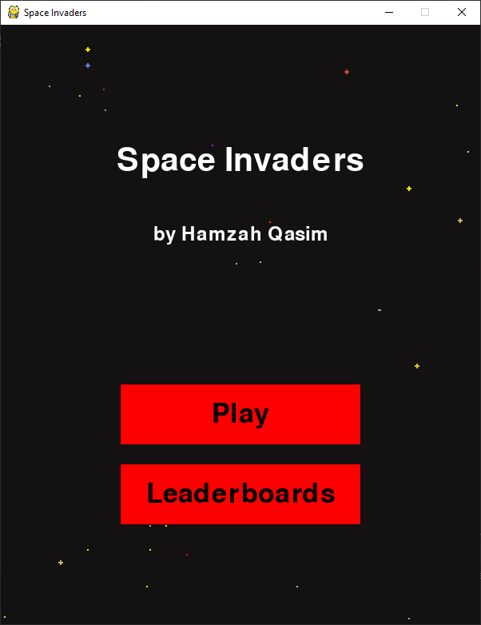
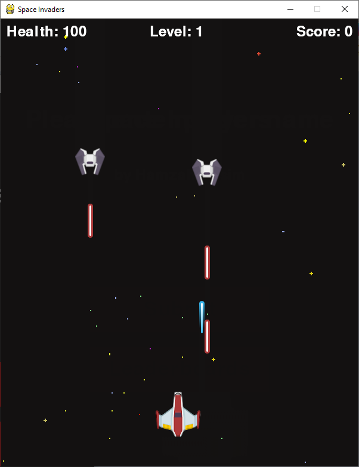
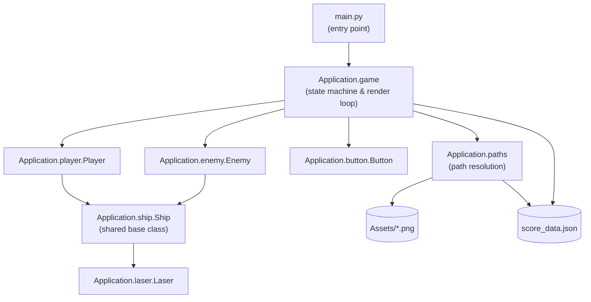
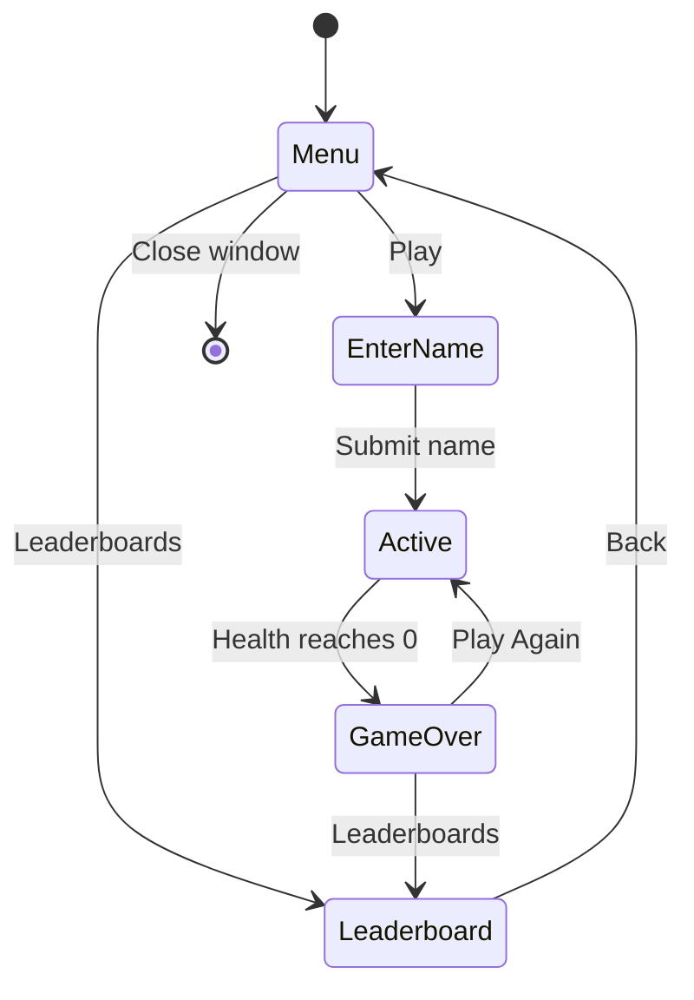

# Space Invaders


A classic arcade shooter, rebuilt from the ground up in Python. Pilot a ship, fight off escalating waves of enemies, and climb a persistent leaderboard — all rendered with [pygame](https://www.pygame.org/).

<p align="center">
  
  &nbsp;&nbsp;
  
</p>

## Table of Contents

- [History](#history)
- [Features](#features)
- [Getting Started](#getting-started)
- [Controls](#controls)
- [Running Tests](#running-tests)
- [Architecture](#architecture)
- [Project Structure](#project-structure)
- [Built With](#built-with)
- [Author](#author)

## History

Space Invaders is a two-dimensional arcade video game, developed in 1978 by Tomohiro Nishikado and originally manufactured and sold by Taito in Japan. The objective is simple: defeat descending waves of enemies by shooting upwards, and win by clearing every wave without losing all your lives.

This implementation was originally built as a capstone project for **COP-2939: Computer Programming Capstone**, part of the A.S. in Computer Programming and Analysis at Hillsborough Community College, Florida, USA. It has since been refined for cleaner setup and structure while preserving the original game logic.

## Features

- **Three game states** — main menu, active gameplay, and a persistent leaderboard — driven by a simple event-based state machine
- **Wave-based difficulty scaling** — each cleared wave spawns more enemies at a higher level
- **Real-time collision detection** using per-pixel pygame masks for accurate hit detection between ships and lasers
- **Persistent leaderboard** — scores are written to and read from a JSON file, so your best runs survive between sessions
- **Object-oriented ship hierarchy** — `Player` and `Enemy` both extend a shared `Ship` base class, keeping movement, firing, and collision logic DRY

## Getting Started

### Requirements

- [Python 3.9+](https://www.python.org/downloads/)
- `pip` (bundled with Python)

No IDE is required — the game runs from any standard terminal.

### Installation

```bash
# 1. Clone the repository
git clone https://github.com/Hqasim/space_invader.git
cd space_invader

# 2. (Recommended) Create and activate a virtual environment
python -m venv venv
venv\Scripts\activate      # Windows
source venv/bin/activate   # macOS / Linux

# 3. Install dependencies
pip install -r requirements.txt
```

### Run the Game

From the project root:

```bash
python main.py
```

That's it — no working-directory setup, `PYTHONPATH` tweaks, or IDE configuration needed. All asset and save-file paths are resolved relative to the project itself, so `main.py` runs the same from anywhere.

## Controls

| Key           | Action        |
|---------------|---------------|
| `↑ ↓ ← →`     | Move ship     |
| `Space`       | Fire laser    |
| Mouse click   | Menu buttons  |

## Running Tests

The project ships with a `unittest` suite covering core game classes and score persistence. From the project root:

```bash
python -m unittest discover -s Tests -v
```

## Architecture

### Module Overview



`Player` and `Enemy` both inherit movement, firing, and collision behavior from `Ship`, overriding only what differs (e.g. laser direction, scoring). `Application.paths` centralizes every file-system path so gameplay code never hardcodes a location relative to the current working directory.

### Game State Flow



## Project Structure

```
space_invader/
├── main.py                  # Entry point — python main.py
├── requirements.txt         # Runtime dependencies
├── Application/
│   ├── game.py               # Game states, render loop, score persistence
│   ├── player.py             # Player ship (extends Ship)
│   ├── enemy.py               # Enemy ship (extends Ship)
│   ├── ship.py                # Shared ship behavior (movement, firing, collision)
│   ├── laser.py                # Laser projectile + collision detection
│   ├── button.py               # Clickable UI button widget
│   ├── paths.py                 # Working-directory-independent path resolution
│   └── score_data.json           # Persistent leaderboard storage
├── Assets/                  # Sprites and backgrounds
├── Tests/                   # unittest suite
└── docs/screenshots/        # README images
```

## Built With

- [Python 3](https://www.python.org/)
- [pygame-ce](https://pyga.me/) — community-maintained fork of pygame

## Author

**Hamzah Qasim**
